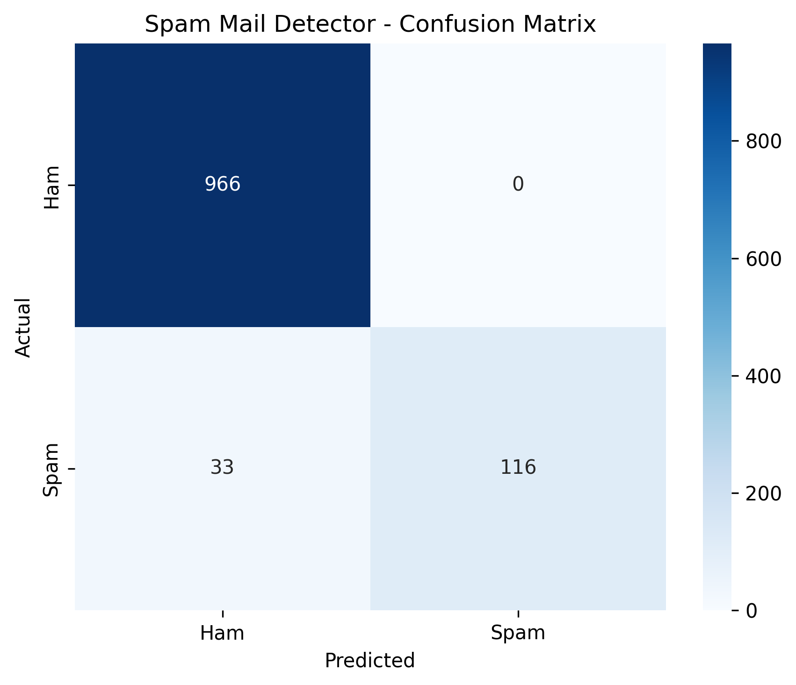

# 📩 Spam Mail Detector

A machine learning project that classifies text messages as **Spam** or **Ham (legitimate)** using Natural Language Processing (NLP), TF-IDF feature extraction, and a Multinomial Naive Bayes classifier.

## 🎯 Objective

The objective of this project is to automatically identify whether a text message is **spam** or a legitimate **ham** message.

## 📊 Dataset

This project uses the **SMS Spam Collection Dataset**, a public dataset containing labeled SMS messages.

Each message is classified into two categories:

* **Ham** – Legitimate message
* **Spam** – Unwanted or fraudulent message

## 🛠️ Technologies Used

* Python
* Pandas
* NumPy
* Scikit-learn
* Matplotlib
* Seaborn
* NLP
* TF-IDF
* Multinomial Naive Bayes

## 🔄 Project Workflow

```text
SMS Message
     ↓
Text Preprocessing
     ↓
TF-IDF Feature Extraction
     ↓
Train/Test Split
     ↓
Multinomial Naive Bayes
     ↓
Spam / Ham Prediction
```

## 🧠 Machine Learning Approach

### TF-IDF

**TF-IDF (Term Frequency-Inverse Document Frequency)** converts text messages into numerical features that can be processed by a machine learning model.

### Multinomial Naive Bayes

Multinomial Naive Bayes is used to classify the TF-IDF features into two classes:

* Spam
* Ham

## 📈 Model Evaluation

The Multinomial Naive Bayes model achieved an accuracy of **97.04%** on the test dataset.

### Classification Report

| Class                | Precision | Recall |   F1-Score |  Support |
| -------------------- | --------: | -----: | ---------: | -------: |
| Ham                  |      0.97 |   1.00 |       0.98 |      966 |
| Spam                 |      1.00 |   0.78 |       0.88 |      149 |
| **Overall Accuracy** |           |        | **97.04%** | **1115** |

### 📊 Confusion Matrix

The confusion matrix shows the correctly and incorrectly classified Ham and Spam messages.




## 📁 Project Structure

```text
Spam-Mail-Detector/
│
├── spam_detector.py
├── requirements.txt
└── README.md
```

## 🚀 How to Run

### 1. Clone the repository

```bash
git clone https://github.com/VK241105/Spam-Mail-Detector.git
```

### 2. Open the project folder

```bash
cd Spam-Mail-Detector
```

### 3. Install dependencies

```bash
pip install -r requirements.txt
```

### 4. Run the project

```bash
python spam_detector.py
```

The program will train the model, display evaluation results, and allow you to enter your own messages for prediction.

## 💬 Example Prediction

```text
Enter a message: Congratulations! You won a free prize!

Prediction: SPAM
```

```text
Enter a message: Hey, are you coming to college tomorrow?

Prediction: HAM
```

## 💡 Skills Demonstrated

* Natural Language Processing
* Text preprocessing
* TF-IDF feature extraction
* Machine Learning classification
* Naive Bayes
* Model evaluation
* Confusion matrix visualization
* Python programming

## 👩‍💻 Author

**Vaishnavi Mane**

B.Tech CSE (Artificial Intelligence & Machine Learning)
Kolhapur Institute of Technology
